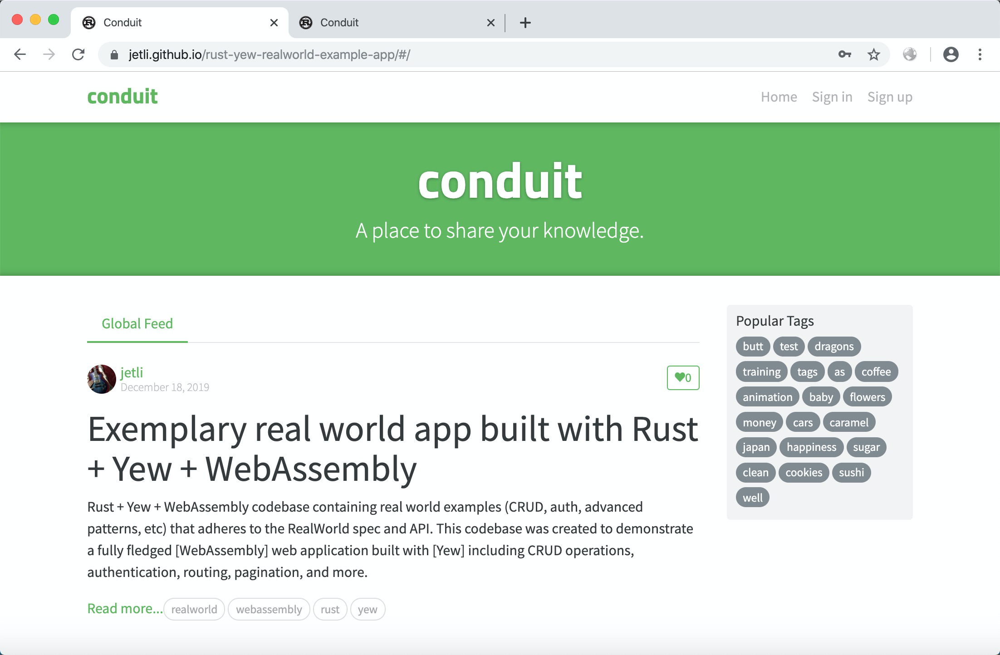
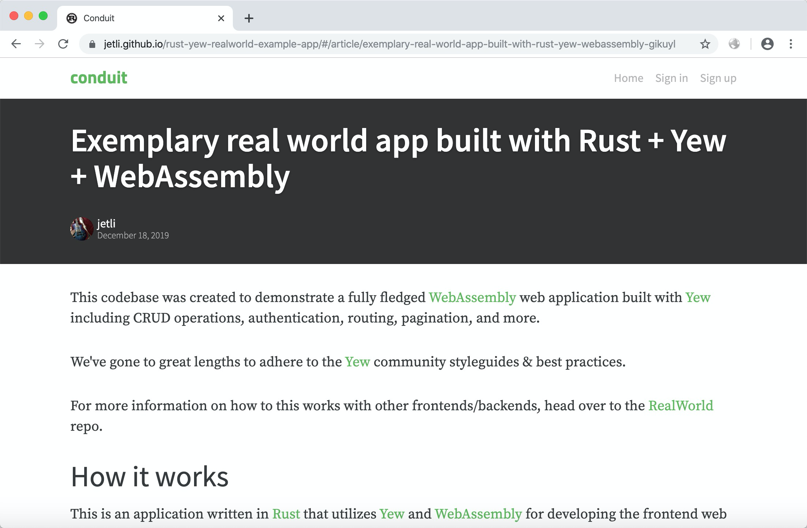
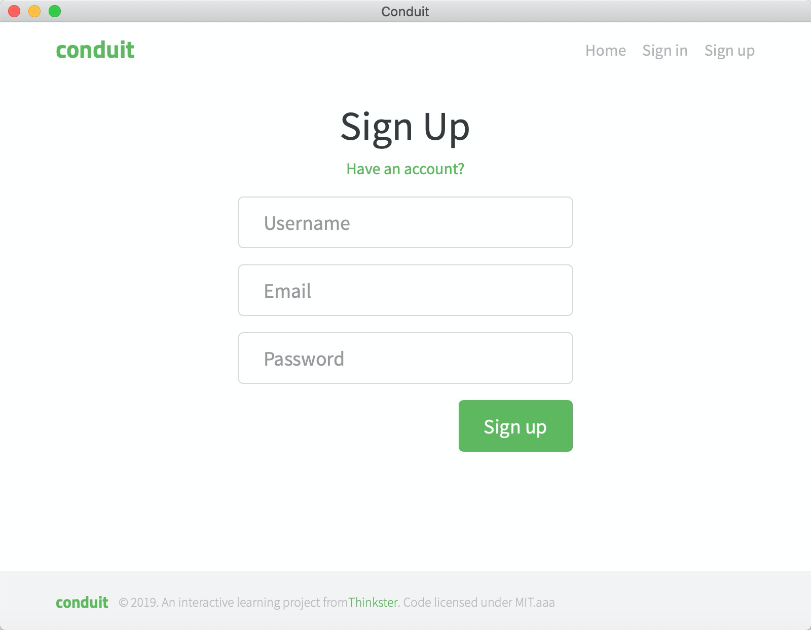

# 

[](https://github.com/jetli/rust-yew-realworld-example-app/actions)
[](http://realworld.io)

> ### [Rust] + [Yew] + [WebAssembly] codebase containing real world examples (CRUD, auth, advanced patterns, etc) that adheres to the [RealWorld] spec and API.


### [Demo]&nbsp;&nbsp;&nbsp;&nbsp;[RealWorld]


This codebase was created to demonstrate a fully fledged [WebAssembly] web application built with [Yew] including CRUD operations, authentication, routing, pagination, and more.

We've gone to great lengths to adhere to the [Yew] community styleguides & best practices.

For more information on how to this works with other frontends/backends, head over to the [RealWorld] repo.

# How it looks

You can view a live demo over at [Demo]

| Home | Article |
| :---:         |     :---:      |
|  |  |

| Edit | Sign Up |
| :---:         |     :---:      |
|  |  |

# How it works

This is an application written in [Rust] that utilizes [Yew] and [WebAssembly] for developing the frontend web app that powers the RealWorld application.

You can view a full list of crates being used in [Cargo.toml], but here are some of the main ones of note:

* [yew] - a modern Rust framework for creating multi-threaded frontend apps with WebAssembly.
* [yew-router] - a routing library for the [Yew] framework.
* [lazy_static] - a macro for declaring lazily evaluated statics in Rust.
* [parking_lot] - provides implementations of `Mutex`, `RwLock`, `Condvar` and `Once` etc.
* [pulldown-cmark] - a pull parser for CommonMark, used to parse Markdown.
* [serde] - a generic serialization/deserialization framework.
* [chrono] - date and time library for Rust.

# Getting started

* Install [Rust]
  ```
  curl --proto '=https' --tlsv1.2 -sSf https://sh.rustup.rs | sh
  ```
* Install [cargo-web]
  ```
  cargo install cargo-web
  ```
* Build and develop
  ```
  cargo web start -p conduit-wasm
  ```
  You can visit `http://[::1]:8000` in your browser now.
* Build and release
  ```
  cargo web deploy -p conduit-wasm --release
  ```
  You should find static files at `target/deploy` folder now, they are hosted in [gh-pages] branch as a demo.

* Build and develop for desktop

  If you're planning on targeting Linux you must ensure that Webkit2gtk is already installed and available for discovery via the pkg-config command.
  ```
  sudo apt-get update
  sudo apt-get install libwebkit2gtk-4.0-37 libwebkit2gtk-4.0-dev
  ```

  ```
  cargo web deploy -p conduit-wasm --release --output crates/conduit-webview/static
  cargo run -p conduit-webview
  ```

# Contributing

Feel free to take a look at the current issues in this repo for anything that currently needs to be worked on.

You are also welcome to open a PR or a new issue if you see something is missing or could be improved upon.

# License

Apache License (Version 2.0)

See [LICENSE] for details

[cargo-web]: https://github.com/koute/cargo-web
[chrono]: https://github.com/chronotope/chrono
[Cargo.toml]: ./crates/conduit-wasm/Cargo.toml
[Demo]: https://jetli.github.io/rust-yew-realworld-example-app/
[gh-pages]: https://github.com/jetli/rust-yew-realworld-example-app/tree/gh-pages
[lazy_static]: https://github.com/rust-lang-nursery/lazy-static.rs
[LICENSE]: ./LICENSE
[parking_lot]: https://github.com/Amanieu/parking_lot
[pulldown-cmark]: https://github.com/raphlinus/pulldown-cmark
[RealWorld]: https://github.com/gothinkster/realworld
[Rust]: https://www.rust-lang.org/
[serde]: https://github.com/serde-rs/serde
[WebAssembly]: https://webassembly.org
[Yew]: https://github.com/yewstack/yew
[yew-router]: https://github.com/yewstack/yew_router
